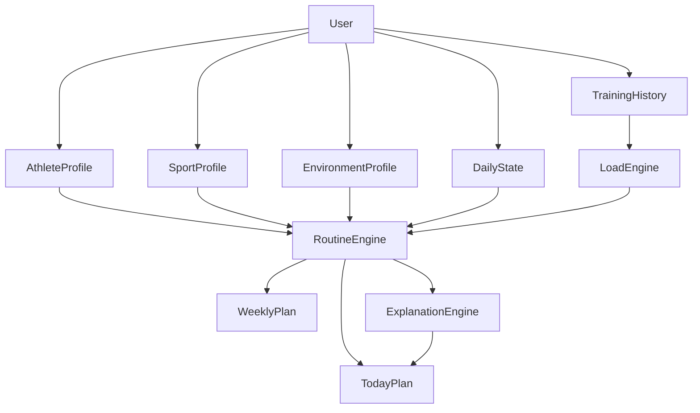

# Vento Vital - Core Model 2026-03-13

Estado: `draft estructural`

Depende de:

- `docs/VITAL-ROADMAP-MAESTRO-2026-03-13.md`
- `docs/VITAL-V1-SPEC-2026-03-13.md`

Proposito: definir el modelo maestro de datos y reglas de Vital para soportar la vision completa del producto sin perder capacidad de construccion por versiones.

---

## 1. Objetivo del Core Model

Vital necesita un modelo que permita responder esta pregunta todos los dias:

> "Dado quien soy, que deporte hago, donde entreno, como llego hoy y que he hecho antes, que me conviene hacer ahora?"

Este documento organiza la respuesta en capas.

No es un schema SQL final.
No es una API final.

Es la estructura conceptual que debe guiar:

- base de datos
- contratos de API
- motor de decision
- UI
- roadmap por versiones

---

## 2. Principio arquitectonico

Vital no debe depender de una sola entidad tipo `user_profile`.

Debe separar el problema en dominios:

- `AthleteProfile`: quien eres
- `SportProfile`: que practicas y con que prioridad
- `EnvironmentProfile`: donde y con que entrenas
- `DailyState`: como llegas hoy
- `TrainingHistory`: que has hecho y como respondiste
- `RoutineEngine`: que conviene generar
- `ExplanationEngine`: como se lo explicamos al usuario

Si todo se mete en una sola tabla grande, el sistema se vuelve inmantenible.

---

## 3. Vista general del modelo

---

## 4. Dominios principales

## 4.1 `AthleteProfile`

Describe el perfil base relativamente estable de la persona.

Campos conceptuales:

- `user_id`
- `display_name`
- `birth_date`
- `age_band`
- `sex`
- `gender_optional`
- `height_cm`
- `weight_kg`
- `body_comp_optional`
- `training_age_months`
- `experience_level`
- `primary_goal`
- `secondary_goals`
- `injury_history_summary`
- `medical_flags`
- `movement_limitations`
- `coaching_preference`
- `units_preference`
- `locale`

Campos derivados posibles:

- `age_group`: youth / adult / masters
- `risk_flags_count`
- `goal_priority_vector`

Uso:

- filtra recomendaciones peligrosas
- define contexto base de progresion
- ayuda a escoger tono y complejidad del plan

---

## 4.2 `SportProfile`

Describe que deportes practica la persona y como se relacionan entre si.

Vital no debe asumir un solo deporte.

Campos conceptuales:

- `user_id`
- `primary_sport`
- `secondary_sports`
- `sport_mix_mode`
- `competition_level`
- `season_phase`
- `competition_calendar`
- `priority_distribution`
- `weekly_availability`
- `skill_focus`
- `performance_targets`

Tipos sugeridos de deporte:

- `strength_hypertrophy`
- `general_fitness`
- `running_endurance`
- `cycling`
- `team_sports`
- `combat_sports`
- `hybrid_performance`

Campos derivados posibles:

- `interference_risk`
- `strength_priority_score`
- `endurance_priority_score`
- `technical_priority_score`

Uso:

- decide como pesa la fuerza frente a la resistencia
- ayuda a priorizar segun calendario competitivo
- condiciona frecuencia, intensidad y recuperacion

---

## 4.3 `EnvironmentProfile`

Describe donde y con que se puede entrenar.

Este modulo es clave para V2.

### 4.3.1 `training_environment_profile`

Campos conceptuales:

- `id`
- `user_id`
- `name`
- `color_token`
- `environment_type`
- `is_primary`
- `is_active`
- `notes`

Valores sugeridos para `environment_type`:

- `full_gym`
- `small_gym`
- `home_gym`
- `outdoor`
- `hotel`
- `limited_access`
- `other`

### 4.3.2 `equipment_category`

Categorias iniciales sugeridas:

- `selectorized_machines`
- `plate_loaded_machines`
- `cable_machines`
- `free_weights`
- `bars`
- `benches`
- `bands`
- `cardio`
- `bodyweight`
- `functional`
- `recovery_tools`

### 4.3.3 `equipment_item_catalog`

Catalogo maestro de recursos.

Campos conceptuales:

- `id`
- `category_key`
- `key`
- `label`
- `aliases`
- `movement_patterns`
- `supports_load`
- `supports_unilateral`
- `supports_cardio_metrics`
- `sport_tags`

### 4.3.4 `profile_equipment_item`

Relacion entre perfil y recurso.

Campos conceptuales:

- `profile_id`
- `equipment_item_id`
- `is_available`
- `custom_label`
- `starting_load_kg_optional`
- `condition_state`
- `notes`

### 4.3.5 `profile_constraints`

Campos conceptuales:

- `profile_id`
- `session_space_level`
- `noise_limit`
- `impact_limit`
- `ceiling_limit`
- `drop_weights_allowed`
- `outdoor_access`
- `climate_exposure`
- `default_session_time_min`

Uso:

- eliminar ejercicios inviables
- proponer sustituciones reales
- adaptar la estructura de la sesion al entorno

---

## 4.4 `DailyState`

Describe como llega la persona hoy.

No es una verdad absoluta.
Es el mejor resumen posible del estado actual para tomar decisiones.

Campos conceptuales minimos:

- `user_id`
- `date`
- `sleep_duration_hours`
- `sleep_quality`
- `energy_level`
- `stress_level`
- `motivation_level`
- `soreness_level`
- `pain_flag`
- `pain_locations`
- `time_available_min`
- `daily_schedule_context`
- `readiness_self_report`
- `notes`

Campos opcionales o posteriores:

- `hrv_rmssd`
- `resting_hr`
- `hydration_status`
- `temperature_context`
- `travel_fatigue`
- `jet_lag`
- `menstrual_cycle_tracking`
- `symptom_flags`
- `red_s_risk_signal`

Uso:

- bajar o subir carga
- cambiar intensidad
- ajustar duracion
- bloquear ejercicios o modulos
- elegir alternativa mas sostenible

---

## 4.5 `TrainingHistory`

Describe que se prescribio, que se hizo y como respondio la persona.

Este dominio alimenta la memoria real del sistema.

### 4.5.1 `training_session`

Campos conceptuales:

- `id`
- `user_id`
- `date`
- `sport_context`
- `session_type`
- `planned_duration_min`
- `completed_duration_min`
- `planned_focus`
- `actual_focus`
- `completion_status`

### 4.5.2 `training_session_load`

Campos conceptuales:

- `session_id`
- `volume_score`
- `intensity_score`
- `internal_load`
- `session_rpe`
- `strain_score`
- `monotony_context_optional`

### 4.5.3 `exercise_execution`

Campos conceptuales:

- `session_id`
- `exercise_key`
- `prescribed_sets`
- `completed_sets`
- `prescribed_reps`
- `completed_reps`
- `load_kg_optional`
- `rpe_optional`
- `tempo_optional`
- `completed_flag`
- `pain_during_flag`

### 4.5.4 `response_marker`

Campos conceptuales:

- `user_id`
- `date`
- `post_session_fatigue`
- `pain_24h`
- `sleep_following_night`
- `recovery_feel`
- `adherence_signal`

Uso:

- evaluar tolerancia real a la carga
- aprender que tan bien responde la persona
- evitar repetir estructuras que no se sostienen

---

## 5. Motores funcionales

## 5.1 `LoadEngine`

Responsabilidad:

- transformar historial en senales utiles

Salidas conceptuales:

- `acute_load_score`
- `chronic_load_score`
- `fatigue_risk_score`
- `adherence_score`
- `consistency_score`
- `recovery_debt_signal`

No necesita ser perfecto en V1 o V2.
Pero si debe existir como capa conceptual.

---

## 5.2 `RoutineEngine`

Responsabilidad:

- decidir que conviene hacer hoy y esta semana

Entradas:

- `AthleteProfile`
- `SportProfile`
- `EnvironmentProfile`
- `DailyState`
- `LoadEngine outputs`
- reglas de seguridad

Salidas:

- `TodayPlan`
- `WeeklyPlan`
- `ExerciseSelection`
- `VolumeAdjustment`
- `IntensityAdjustment`
- `AlternativeOptions`

La regla central:

el motor no optimiza una sola variable.
Equilibra objetivo, entorno, estado diario y sostenibilidad.

---

## 5.3 `ExplanationEngine`

Responsabilidad:

- traducir la decision del motor a lenguaje humano corto y claro

Ejemplos de salidas:

- `Baje la carga por sueño bajo y fatiga alta`
- `Priorice tren superior porque mañana tienes partido`
- `Sustitui prensa por smith porque tu entorno actual no tiene esa maquina`
- `Mantuve el plan porque tu estado y adherencia vienen estables`

Regla:

ningun ajuste importante deberia sentirse magico.

---

## 6. Objetos de salida del sistema

## 6.1 `TodayPlan`

Campos conceptuales:

- `date`
- `readiness_summary`
- `primary_focus`
- `secondary_focus`
- `recommended_session_type`
- `recommended_duration_min`
- `task_list`
- `adjustment_summary`
- `safety_state`
- `explanation_summary`

## 6.2 `TodayTask`

Campos conceptuales:

- `id`
- `module_key`
- `task_type`
- `title`
- `status`
- `priority_score`
- `reason_code`
- `reason_text`
- `safety_state`
- `action_options`

## 6.3 `WeeklyPlan`

Campos conceptuales:

- `week_start`
- `weekly_goal`
- `sessions`
- `load_distribution`
- `recovery_slots`
- `competition_constraints`
- `interference_notes`

---

## 7. Jerarquia de decision

Vital debe tomar decisiones en este orden:

1. `Safety`
2. `Eligibility`
3. `Environment fit`
4. `Daily state fit`
5. `Goal alignment`
6. `Sport alignment`
7. `Load sustainability`
8. `User clarity`

Traduccion:

- primero evitar lo peligroso
- luego verificar si es posible
- luego verificar si cabe hoy
- luego verificar si ayuda al objetivo
- luego verificar si se sostiene
- luego explicarlo

---

## 8. Taxonomia de restricciones

Vital necesita distinguir entre restricciones:

### 8.1 Duras

- dolor fuerte
- lesion activa
- red flags de seguridad
- equipamiento inexistente
- tiempo demasiado bajo
- contexto medico incompatible

### 8.2 Blandas

- energia baja
- estres alto
- poca motivacion
- mala noche de sueño
- travel fatigue
- calor fuerte

### 8.3 Preferencias

- ejercicios favoritos
- tipo de cardio preferido
- gusto por maquinas o pesos libres
- horario favorito

El motor no debe tratar una preferencia como si fuera una restriccion dura.

---

## 9. Taxonomia de patrones de movimiento

Para soportar sustituciones reales, el catalogo de ejercicios deberia etiquetar al menos:

- `squat`
- `hinge`
- `horizontal_push`
- `vertical_push`
- `horizontal_pull`
- `vertical_pull`
- `single_leg`
- `core_anti_extension`
- `core_anti_rotation`
- `carry`
- `gait_cyclical`
- `interval_conditioning`

Y ademas:

- demanda tecnica
- demanda de estabilidad
- demanda de equipamiento
- costo de fatiga
- especificidad para fuerza
- especificidad para hipertrofia
- especificidad para resistencia

---

## 10. Variables de roadmap por version

## V1

Debe operar con:

- `AthleteProfile` minimo
- `SportProfile` minimo
- `DailyState` muy simple
- `TodayPlan` simple
- `TodayTask`

## V2

Agrega:

- `EnvironmentProfile`
- `equipment_item_catalog`
- `profile_equipment_item`

## V3

Profundiza:

- `DailyState`
- `response_marker`
- `session_rpe`

## V4

Activa plenamente:

- `RoutineEngine`
- `LoadEngine`
- `ExplanationEngine`

## V5

Expande:

- integraciones
- variables fisiologicas
- recovery y nutricion profunda
- mas deportes

---

## 11. Guardrails del modelo

- Vital no es un dispositivo medico.
- El sistema no debe emitir diagnosticos.
- `HRV` y wearables son senales, no jueces absolutos.
- El ciclo menstrual se usa como contexto de salud y sintomas, no como regla universal simplista.
- El dolor debe modular decisiones, no reducirse a una sola bandera binaria.
- Si faltan datos, el sistema debe degradar elegantemente, no inventar precision.

---

## 12. Contratos minimos que este modelo sugiere

No son finales, pero si orientan la API futura.

- `GET /api/athlete-profile/me`
- `PUT /api/athlete-profile/me`
- `GET /api/sport-profile/me`
- `PUT /api/sport-profile/me`
- `GET /api/environment-profiles`
- `POST /api/environment-profiles`
- `PUT /api/environment-profiles/:id`
- `GET /api/environment-profiles/:id/equipment`
- `PUT /api/environment-profiles/:id/equipment`
- `GET /api/daily-state?date=YYYY-MM-DD`
- `PUT /api/daily-state?date=YYYY-MM-DD`
- `GET /api/hoy/feed?date=YYYY-MM-DD`
- `GET /api/planning/weekly?week_start=YYYY-MM-DD`

---

## 13. Decisiones estrategicas que este modelo fija

1. Vital no sera una app de gym cerrada.
2. Vital nacera con arquitectura multisport.
3. La primera gran version funcional seguira enfocada en entrenamiento adaptativo.
4. El entorno real y el estado diario son dominios de primer orden.
5. El producto debe ser explicable por diseño.

---

## 14. Siguiente paso recomendado

Los documentos naturales despues de este son:

1. `VITAL-V2-SPEC.md`
   - basado en `EnvironmentProfile`
   - perfiles de entrenamiento
   - equipamiento y restricciones

2. `VITAL-DOMAIN-SCHEMA-v1.md`
   - traduccion de este modelo a tablas, enums y contratos iniciales

3. `VITAL-DECISION-RULES-v1.md`
   - primeras reglas de `RoutineEngine`
   - prioridades, bloqueos, sustituciones y ajustes
