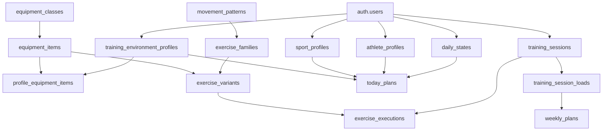

# Vento Vital - Domain Schema v1 2026-03-13

Estado: `draft tecnico`

Depende de:

- `docs/VITAL-ROADMAP-MAESTRO-2026-03-13.md`
- `docs/VITAL-CORE-MODEL-2026-03-13.md`
- `docs/VITAL-V2-SPEC-2026-03-13.md`
- `docs/VITAL-V3-SPEC-2026-03-13.md`
- `docs/VITAL-DECISION-RULES-v1-2026-03-13.md`
- `docs/VITAL-EXERCISE-CATALOG-SPEC-2026-03-13.md`
- `docs/VITAL-CATALOG-SEED-DATA-v1-2026-03-13.md`

Proposito: traducir la arquitectura conceptual de Vital a un schema de dominio implementable, listo para orientar tablas, enums, contratos de API y modelos de aplicacion.

---

## 1. Objetivo del schema

Este documento existe para responder:

- que entidades necesita Vital de verdad
- como se relacionan entre si
- que campos deben ser persistidos
- que enums y tipos conviene fijar temprano
- que objetos de contrato deben existir entre backend y app

No define SQL exacto ni migraciones finales.

Si define:

- boundaries de dominio
- entidades nucleares
- relaciones
- claves y restricciones
- sugerencias de objetos de lectura y escritura

---

## 2. Modulos de dominio

Vital deberia organizarse en estos modulos:

1. `identity`
2. `athlete_profile`
3. `sport_profile`
4. `environment`
5. `catalog`
6. `daily_state`
7. `training_history`
8. `planning`
9. `decision_engine`
10. `explanation`

Separar estos modulos evita meter toda la logica en una sola tabla tipo `profiles`.

---

## 3. Vista general de relaciones



---

## 4. Enums base

## 4.1 User and athlete enums

### `experience_level`

- `novice`
- `early_intermediate`
- `intermediate`
- `advanced`

### `primary_goal`

- `fat_loss`
- `hypertrophy`
- `strength`
- `general_fitness`
- `sport_performance`
- `maintenance`
- `recovery_rebuild`

### `age_group`

- `youth`
- `adult`
- `masters`

### `sex`

- `female`
- `male`
- `intersex`
- `prefer_not_to_say`

---

## 4.2 Sport enums

### `sport_key`

- `strength_hypertrophy`
- `general_fitness`
- `running_endurance`
- `cycling`
- `team_sports`
- `combat_sports`
- `hybrid_performance`

### `competition_level`

- `recreational`
- `amateur`
- `competitive`
- `elite`

### `season_phase`

- `off_season`
- `pre_season`
- `in_season`
- `peak`
- `transition`

---

## 4.3 Environment enums

### `environment_type`

- `full_gym`
- `small_gym`
- `home_gym`
- `outdoor`
- `hotel`
- `limited_access`
- `other`

### `condition_state`

- `normal`
- `limited`
- `unstable`
- `broken`

### `space_level`

- `very_limited`
- `limited`
- `normal`
- `large`

### `impact_limit`

- `none`
- `low`
- `medium`
- `high`

---

## 4.4 Daily state enums

### `likert_1_5`

- `1`
- `2`
- `3`
- `4`
- `5`

### `time_available_bucket`

- `lt_15`
- `min_20_30`
- `min_30_45`
- `min_45_60`
- `gt_60`

### `pain_severity`

- `none`
- `mild`
- `moderate`
- `high`

### `daily_state_overall`

- `high_readiness`
- `stable`
- `reduced_capacity`
- `caution`

---

## 4.5 Planning enums

### `today_plan_session_type`

- `main_training`
- `short_session`
- `recovery_session`
- `minimum_viable_session`
- `technique_session`
- `cardio_session`
- `blocked_or_caution`

### `decision_action_type`

- `maintain_plan`
- `reduce_volume`
- `reduce_intensity`
- `swap_exercises`
- `shorten_session`
- `switch_focus`
- `recovery_day`
- `minimum_viable_session`
- `block_session`

### `task_status`

- `pending`
- `in_progress`
- `completed`
- `snoozed`
- `skipped`

### `safety_state`

- `ok`
- `caution`
- `blocked`

---

## 4.6 Catalog enums

### `equipment_class_key`

- `bodyweight`
- `bodyweight_with_anchor`
- `barbell`
- `dumbbell`
- `kettlebell`
- `machine_selectorized`
- `machine_plate_loaded`
- `cable`
- `band`
- `suspension`
- `medicine_ball`
- `sandbag`
- `strongman_implement`
- `cardio_ergometer`
- `cardio_machine`
- `sled`
- `club_mace`
- `functional`
- `recovery_tool`

### `movement_pattern_key`

- `squat_bilateral`
- `squat_unilateral`
- `hinge_bilateral`
- `hinge_unilateral`
- `horizontal_push`
- `vertical_push`
- `horizontal_pull`
- `vertical_pull`
- `carry`
- `gait_cyclical`
- `rotation`
- `anti_rotation`
- `anti_extension`
- `anti_flexion`
- `anti_lateral_flexion`
- `locomotion`
- `jump`
- `hop`
- `bound`
- `throw`
- `neck`
- `grip`
- `scapular_control`
- `hip_abduction_adduction`
- `ankle_foot_complex`
- `mobility_articular`
- `mobility_dynamic`
- `corrective_activation`
- `corrective_integration`

### `difficulty_tier`

- `very_low`
- `low`
- `medium`
- `high`
- `very_high`

### `fatigue_cost`

- `low`
- `medium`
- `high`

### `plane_of_motion`

- `sagittal`
- `frontal`
- `transverse`
- `multiplanar`

---

## 5. Tablas nucleares

## 5.1 `athlete_profiles`

Una fila por usuario.

Campos sugeridos:

- `user_id uuid pk fk auth.users`
- `display_name text`
- `birth_date date null`
- `age_group age_group null`
- `sex sex null`
- `height_cm numeric null`
- `weight_kg numeric null`
- `training_age_months int null`
- `experience_level experience_level`
- `primary_goal primary_goal`
- `secondary_goals jsonb default '[]'`
- `injury_history_summary text null`
- `medical_flags jsonb default '[]'`
- `movement_limitations jsonb default '[]'`
- `coaching_preference text null`
- `units_preference text default 'metric'`
- `locale text default 'es-CO'`
- `created_at timestamptz`
- `updated_at timestamptz`

Restricciones:

- `user_id` unico

---

## 5.2 `sport_profiles`

Una fila activa por usuario para configuracion principal.
Si luego se requiere historial o multiples configuraciones, puede evolucionar.

Campos sugeridos:

- `user_id uuid pk fk auth.users`
- `primary_sport sport_key`
- `secondary_sports jsonb default '[]'`
- `competition_level competition_level`
- `season_phase season_phase`
- `sport_mix_mode text default 'single_priority'`
- `priority_distribution jsonb default '{}'`
- `weekly_availability jsonb default '{}'`
- `performance_targets jsonb default '{}'`
- `competition_calendar jsonb default '[]'`
- `created_at timestamptz`
- `updated_at timestamptz`

---

## 5.3 `training_environment_profiles`

Multiples filas por usuario.

Campos sugeridos:

- `id uuid pk`
- `user_id uuid fk auth.users`
- `name text`
- `color_token text null`
- `environment_type environment_type`
- `is_primary boolean default false`
- `is_active boolean default true`
- `notes text null`
- `created_at timestamptz`
- `updated_at timestamptz`

Restricciones:

- solo un `is_primary = true` por usuario

---

## 5.4 `profile_constraints`

Una fila por `training_environment_profile`.

Campos sugeridos:

- `profile_id uuid pk fk training_environment_profiles.id`
- `session_space_level space_level default 'normal'`
- `noise_limit impact_limit default 'high'`
- `impact_limit impact_limit default 'high'`
- `ceiling_limit text null`
- `drop_weights_allowed boolean default true`
- `outdoor_access boolean default false`
- `climate_exposure text null`
- `default_session_time_min int null`
- `created_at timestamptz`
- `updated_at timestamptz`

---

## 5.5 `daily_states`

Una fila por usuario por fecha.

Campos sugeridos:

- `user_id uuid fk auth.users`
- `state_date date`
- `sleep_duration_hours numeric null`
- `sleep_quality smallint null`
- `energy_level smallint null`
- `stress_level smallint null`
- `motivation_level smallint null`
- `soreness_level smallint null`
- `pain_flag boolean default false`
- `time_available_bucket time_available_bucket null`
- `time_available_min int null`
- `daily_schedule_context text null`
- `readiness_self_report smallint null`
- `notes text null`
- `overall_state daily_state_overall null`
- `created_at timestamptz`
- `updated_at timestamptz`

PK sugerida:

- `(user_id, state_date)`

---

## 5.6 `daily_state_pain_locations`

Tabla hija de `daily_states`.

Campos sugeridos:

- `id uuid pk`
- `user_id uuid`
- `state_date date`
- `location_key text`
- `severity pain_severity`
- `notes text null`

FK compuesta sugerida:

- `(user_id, state_date)` -> `daily_states`

---

## 6. Tablas de catalogo

## 6.1 `equipment_classes`

Campos:

- `key equipment_class_key pk`
- `label text`
- `sort_order int`

## 6.2 `equipment_items`

Campos sugeridos:

- `id uuid pk`
- `equipment_class_key equipment_class_key fk`
- `key text unique`
- `label text`
- `aliases jsonb default '[]'`
- `is_portable boolean default false`
- `supports_load_progression boolean default false`
- `requires_anchor boolean default false`
- `space_cost text null`
- `impact_level text null`
- `env_tags jsonb default '[]'`
- `notes text null`
- `created_at timestamptz`
- `updated_at timestamptz`

## 6.3 `movement_patterns`

Campos:

- `key movement_pattern_key pk`
- `label text`
- `sort_order int`

## 6.4 `exercise_families`

Campos sugeridos:

- `id uuid pk`
- `key text unique`
- `label text`
- `primary_pattern_key movement_pattern_key fk`
- `default_stimulus_tags jsonb default '[]'`
- `base_env_tags jsonb default '[]'`
- `notes text null`

## 6.5 `exercise_variants`

Campos sugeridos:

- `id uuid pk`
- `key text unique`
- `family_id uuid fk exercise_families.id`
- `name text`
- `equipment_item_id uuid fk equipment_items.id null`
- `primary_pattern_key movement_pattern_key fk`
- `difficulty_tier difficulty_tier`
- `fatigue_cost fatigue_cost`
- `goal_tags jsonb default '[]'`
- `sport_tags jsonb default '[]'`
- `env_tags jsonb default '[]'`
- `restriction_tags jsonb default '[]'`
- `substitution_group text null`
- `technical_demand difficulty_tier null`
- `stability_demand difficulty_tier null`
- `plane_of_motion plane_of_motion null`
- `is_unilateral boolean default false`
- `is_bilateral boolean default false`
- `loadable boolean default false`
- `requires_spotter boolean default false`
- `notes text null`
- `created_at timestamptz`
- `updated_at timestamptz`

## 6.6 `exercise_variant_patterns`

Porque un ejercicio puede tener mas de un patron relevante.

Campos sugeridos:

- `exercise_variant_id uuid fk`
- `movement_pattern_key movement_pattern_key fk`
- `is_primary boolean default false`

PK sugerida:

- `(exercise_variant_id, movement_pattern_key)`

## 6.7 `exercise_variant_equipment_optional`

Equipos opcionales o alternos para una variante.

Campos sugeridos:

- `exercise_variant_id uuid fk`
- `equipment_item_id uuid fk`

PK sugerida:

- `(exercise_variant_id, equipment_item_id)`

---

## 7. Tablas de entorno aplicado

## 7.1 `profile_equipment_items`

Relacion entre un perfil y un recurso del catalogo.

Campos sugeridos:

- `id uuid pk`
- `profile_id uuid fk training_environment_profiles.id`
- `equipment_item_id uuid fk equipment_items.id`
- `is_available boolean default false`
- `custom_label text null`
- `starting_load_kg numeric null`
- `condition_state condition_state default 'normal'`
- `notes text null`
- `updated_at timestamptz`

Restricciones:

- `(profile_id, equipment_item_id)` unico

---

## 8. Tablas de historial

## 8.1 `training_sessions`

Campos sugeridos:

- `id uuid pk`
- `user_id uuid fk auth.users`
- `session_date date`
- `sport_context sport_key null`
- `session_type today_plan_session_type null`
- `planned_duration_min int null`
- `completed_duration_min int null`
- `planned_focus text null`
- `actual_focus text null`
- `completion_status text`
- `source_plan_id uuid null`
- `created_at timestamptz`
- `updated_at timestamptz`

## 8.2 `training_session_loads`

Campos sugeridos:

- `session_id uuid pk fk training_sessions.id`
- `volume_score numeric null`
- `intensity_score numeric null`
- `internal_load numeric null`
- `session_rpe numeric null`
- `strain_score numeric null`
- `notes text null`

## 8.3 `exercise_executions`

Campos sugeridos:

- `id uuid pk`
- `session_id uuid fk training_sessions.id`
- `exercise_variant_id uuid fk exercise_variants.id`
- `prescribed_sets int null`
- `completed_sets int null`
- `prescribed_reps text null`
- `completed_reps text null`
- `load_kg numeric null`
- `rpe numeric null`
- `tempo text null`
- `completed_flag boolean default false`
- `pain_during_flag boolean default false`
- `notes text null`

## 8.4 `response_markers`

Campos sugeridos:

- `id uuid pk`
- `user_id uuid fk auth.users`
- `marker_date date`
- `post_session_fatigue smallint null`
- `pain_24h smallint null`
- `sleep_following_night smallint null`
- `recovery_feel smallint null`
- `adherence_signal smallint null`
- `notes text null`

---

## 9. Tablas de planeacion y decision

## 9.1 `today_plans`

Campos sugeridos:

- `id uuid pk`
- `user_id uuid fk auth.users`
- `plan_date date`
- `overall_state daily_state_overall null`
- `session_type today_plan_session_type`
- `primary_focus text`
- `secondary_focus text null`
- `recommended_duration_min int null`
- `intensity_adjustment text null`
- `volume_adjustment text null`
- `recommended_structure jsonb default '{}'`
- `explanation_summary text null`
- `caution_flags jsonb default '[]'`
- `source_environment_profile_id uuid null`
- `source_decision_version text default 'v1'`
- `created_at timestamptz`
- `updated_at timestamptz`

Restricciones:

- `(user_id, plan_date)` unico

## 9.2 `today_tasks`

Campos sugeridos:

- `id uuid pk`
- `today_plan_id uuid fk today_plans.id`
- `module_key text`
- `task_type text`
- `title text`
- `status task_status default 'pending'`
- `priority_score numeric null`
- `reason_code text null`
- `reason_text text null`
- `safety_state safety_state default 'ok'`
- `action_options jsonb default '[]'`
- `sort_order int default 0`
- `created_at timestamptz`
- `updated_at timestamptz`

## 9.3 `weekly_plans`

Campos sugeridos:

- `id uuid pk`
- `user_id uuid fk auth.users`
- `week_start date`
- `weekly_goal text null`
- `load_distribution jsonb default '{}'`
- `competition_constraints jsonb default '[]'`
- `interference_notes jsonb default '[]'`
- `created_at timestamptz`
- `updated_at timestamptz`

---

## 10. Tablas opcionales de reglas y sustitucion

Estas pueden nacer despues, pero conviene dejar su forma.

## 10.1 `exercise_substitution_rules`

Campos sugeridos:

- `id uuid pk`
- `source_variant_id uuid fk exercise_variants.id`
- `target_variant_id uuid fk exercise_variants.id`
- `substitution_confidence numeric`
- `reason_type text`
- `requires_same_pattern boolean default true`
- `requires_equipment_check boolean default true`
- `notes text null`

## 10.2 `decision_rule_versions`

Campos sugeridos:

- `key text pk`
- `version text`
- `is_active boolean`
- `notes text null`
- `updated_at timestamptz`

---

## 11. Lecturas y objetos de contrato

La app no deberia consumir las tablas crudas directamente.

Necesita objetos agregados.

## 11.1 `AthleteProfileDTO`

```ts
type AthleteProfileDTO = {
  displayName: string;
  ageGroup: "youth" | "adult" | "masters" | null;
  sex: string | null;
  experienceLevel: string;
  primaryGoal: string;
  secondaryGoals: string[];
  movementLimitations: string[];
  medicalFlags: string[];
};
```

## 11.2 `EnvironmentProfileDTO`

```ts
type EnvironmentProfileDTO = {
  id: string;
  name: string;
  environmentType: string;
  isPrimary: boolean;
  isActive: boolean;
  colorToken: string | null;
  equipmentSummary: {
    totalAvailable: number;
    availableKeys: string[];
  };
  constraints: {
    spaceLevel: string;
    impactLimit: string;
    defaultSessionTimeMin: number | null;
  };
};
```

## 11.3 `DailyStateDTO`

```ts
type DailyStateDTO = {
  date: string;
  sleepDurationHours: number | null;
  sleepQuality: number | null;
  energyLevel: number | null;
  stressLevel: number | null;
  motivationLevel: number | null;
  sorenessLevel: number | null;
  painFlag: boolean;
  painLocations: Array<{ locationKey: string; severity: string }>;
  timeAvailableBucket: string | null;
  timeAvailableMin: number | null;
  readinessSelfReport: number | null;
  overallState: string | null;
};
```

## 11.4 `TodayPlanDTO`

```ts
type TodayPlanDTO = {
  id: string;
  date: string;
  overallState: string | null;
  sessionType: string;
  primaryFocus: string;
  secondaryFocus: string | null;
  recommendedDurationMin: number | null;
  intensityAdjustment: string | null;
  volumeAdjustment: string | null;
  explanationSummary: string | null;
  cautionFlags: string[];
  tasks: TodayTaskDTO[];
};
```

## 11.5 `TodayTaskDTO`

```ts
type TodayTaskDTO = {
  id: string;
  moduleKey: string;
  taskType: string;
  title: string;
  status: string;
  priorityScore: number | null;
  reasonCode: string | null;
  reasonText: string | null;
  safetyState: string;
  actionOptions: string[];
};
```

---

## 12. Indices y restricciones sugeridas

Indices de alto valor:

- `daily_states (user_id, state_date desc)`
- `today_plans (user_id, plan_date desc)`
- `training_sessions (user_id, session_date desc)`
- `training_environment_profiles (user_id, is_primary)`
- `profile_equipment_items (profile_id, is_available)`
- `equipment_items (key)`
- `exercise_families (key)`
- `exercise_variants (key)`
- `exercise_variants (family_id)`

Restricciones clave:

- un `athlete_profile` por usuario
- un `sport_profile` principal por usuario
- un `today_plan` por usuario por fecha
- un `daily_state` por usuario por fecha
- un solo entorno primario por usuario
- una sola fila de recurso por perfil y equipo

---

## 13. Estrategia de implementacion por fases

## Fase A

Implementar primero:

- `athlete_profiles`
- `sport_profiles`
- `daily_states`
- `today_plans`
- `today_tasks`

Motivo:

eso sostiene `V1`, `V3` y una primera lectura adaptativa.

## Fase B

Implementar luego:

- `training_environment_profiles`
- `profile_constraints`
- `equipment_classes`
- `equipment_items`
- `profile_equipment_items`

Motivo:

eso sostiene `V2`.

## Fase C

Implementar luego:

- `exercise_families`
- `exercise_variants`
- `exercise_variant_patterns`
- `exercise_variant_equipment_optional`
- `exercise_substitution_rules`

Motivo:

eso habilita un `RoutineEngine` mas serio.

## Fase D

Implementar luego:

- `training_sessions`
- `training_session_loads`
- `exercise_executions`
- `response_markers`
- `weekly_plans`

Motivo:

eso habilita sostenibilidad e historial fuerte.

---

## 14. Decisiones tecnicas recomendadas

### 14.1 `jsonb` vs tablas hijas

Usar `jsonb` cuando:

- el dato es flexible
- la estructura puede variar
- no se va a consultar intensivamente por cada subcampo

Usar tablas hijas cuando:

- la relacion es many-to-many
- se necesita filtrar y consultar de forma frecuente
- se necesita integridad fuerte

### 14.2 `DTOs` agregados

La app movil debe recibir objetos agregados y limpios.

No conviene atarla a joins manuales en cada pantalla.

### 14.3 Versionado de reglas

El motor debe poder versionarse.

No conviene que las reglas vivan como magia embebida sin trazabilidad.

---

## 15. Criterio de aceptacion del schema

Este schema `v1` esta bien si:

- representa el roadmap sin colapsar todo en una tabla gigante
- soporta `V1`, `V2`, `V3` y `V4`
- puede crecer hacia muchos deportes y entornos
- soporta catalogo y sustituciones
- deja clara la frontera entre datos crudos y objetos para UI

---

## 16. Siguiente paso recomendado

Documentos siguientes sugeridos:

1. `VITAL-SUBSTITUTION-RULES-v1.md`
   - mapa detallado de sustituciones por familia y entorno

2. `VITAL-CATALOG-QA-CHECKLIST-v1.md`
   - checklist para validar consistencia del catalogo seed

3. `VITAL-API-CONTRACTS-v1.md`
   - endpoints y payloads concretos

Recomendacion:

si el objetivo inmediato es seguir estructurando inteligencia, el siguiente documento de mas valor es `VITAL-SUBSTITUTION-RULES-v1.md`.
