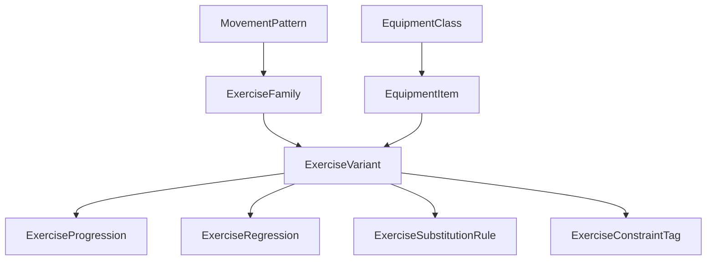

# Vento Vital - Exercise Catalog Spec 2026-03-13

Estado: `draft estructural amplio`

Depende de:

- `docs/VITAL-ROADMAP-MAESTRO-2026-03-13.md`
- `docs/VITAL-CORE-MODEL-2026-03-13.md`
- `docs/VITAL-V2-SPEC-2026-03-13.md`
- `docs/VITAL-DECISION-RULES-v1-2026-03-13.md`

Proposito: definir un catalogo maestro de ejercicios y equipamiento para Vital, lo suficientemente amplio como para soportar multiples deportes, multiples entornos y miles de variantes, sin reducir el sistema a una lista plana y fragil.

---

## 1. Objetivo del catalogo

Vital necesita un catalogo que sirva para:

- seleccionar ejercicios
- sustituir ejercicios
- escalar o regressar ejercicios
- adaptar por equipamiento
- adaptar por deporte
- adaptar por contexto y dolor
- soportar fuerza, hipertrofia, cardio, potencia, movilidad, recuperacion y condicionamiento

La meta no es guardar "nombres de ejercicios".

La meta es modelar:

- familias de movimiento
- patrones
- implementos
- demandas tecnicas
- costo de fatiga
- variaciones
- progresiones
- regressiones
- elegibilidad

---

## 2. Principio rector

Un ejercicio no debe existir en Vital como una etiqueta aislada.

Cada ejercicio debe poder responder:

- que patron usa
- que estimulo dominante produce
- con que equipos se puede hacer
- que variantes tiene
- que regressiones tiene
- que progresiones tiene
- por cuales alternativas se puede sustituir
- que restricciones lo vuelven mala idea

---

## 3. Fundamento externo util

La investigacion y directorios amplios en internet sugieren una estructura muy util para Vital:

- `ExRx` demuestra que un catalogo serio necesita filtrar por musculo, patron, aparato, mecanica y dificultad.
- `NSCA` refuerza que la seleccion de ejercicios debe organizarse por patrones de movimiento, no solo por grupos musculares.
- `ACSM` respalda la utilidad de mezclar ejercicios multiarticulares y monoarticulares, y de contemplar pesos libres, maquinas y otras formas de resistencia.
- taxonomias amplias de gym y cardio muestran que el catalogo debe cubrir desde gimnasio comercial hasta hotel, home gym, calistenia y strongman.

Esto significa que el catalogo de Vital debe mezclar:

- clasificacion por patron
- clasificacion por equipo
- clasificacion por estimulo
- clasificacion por contexto

---

## 4. Que NO es este documento

Este documento no pretende:

- enumerar literalmente cada ejercicio del planeta
- convertirse en un diccionario medico
- fijar un schema SQL final

Si pretende:

- construir una taxonomia maestra muy amplia
- dejar el catalogo listo para crecer a miles de items
- evitar que Vital nazca con una estructura pobre

---

## 5. Arquitectura del catalogo

Vital deberia separar el catalogo en estas entidades:

- `equipment_class`
- `equipment_item`
- `movement_pattern`
- `exercise_family`
- `exercise_variant`
- `exercise_progression`
- `exercise_regression`
- `exercise_substitution_rule`
- `exercise_constraint_tag`

---

## 6. Entidades maestras

## 6.1 `equipment_class`

La clase amplia del implemento.

Valores sugeridos:

- `bodyweight`
- `barbell`
- `dumbbell`
- `kettlebell`
- `machine_selectorized`
- `machine_plate_loaded`
- `cable`
- `band`
- `suspension`
- `medicine_ball`
- `sandbag`
- `strongman_implement`
- `cardio_ergometer`
- `cardio_machine`
- `sled`
- `bodyweight_with_anchor`
- `club_mace`
- `recovery_tool`

## 6.2 `equipment_item`

Recurso concreto.

Campos conceptuales:

- `id`
- `equipment_class`
- `key`
- `label`
- `aliases`
- `requires_anchor`
- `is_portable`
- `space_cost`
- `impact_level`
- `supports_load_progression`

## 6.3 `movement_pattern`

Patron biomecanico dominante.

### Patrones primarios

- `squat_bilateral`
- `squat_unilateral`
- `hinge_bilateral`
- `hinge_unilateral`
- `horizontal_push`
- `vertical_push`
- `horizontal_pull`
- `vertical_pull`
- `carry`
- `gait_cyclical`
- `rotation`
- `anti_rotation`
- `anti_extension`
- `anti_flexion`
- `anti_lateral_flexion`
- `locomotion`
- `jump`
- `hop`
- `bound`
- `throw`
- `neck`
- `grip`
- `scapular_control`
- `hip_abduction_adduction`
- `ankle_foot_complex`
- `mobility_articular`
- `mobility_dynamic`
- `corrective_activation`
- `corrective_integration`

## 6.4 `exercise_family`

Es la unidad semantica principal del catalogo.

Ejemplos:

- `back_squat_family`
- `front_squat_family`
- `leg_press_family`
- `push_up_family`
- `pull_up_family`
- `barbell_row_family`
- `lat_pulldown_family`
- `romanian_deadlift_family`
- `row_ergometer_family`
- `assault_bike_family`
- `turkish_get_up_family`

## 6.5 `exercise_variant`

Es la version concreta utilizable por el sistema.

Ejemplos:

- `high_bar_back_squat`
- `box_back_squat`
- `goblet_box_squat`
- `assisted_pull_up_band`
- `neutral_grip_lat_pulldown`
- `single_arm_half_kneeling_cable_press`

Campos conceptuales:

- `id`
- `family_key`
- `name`
- `movement_patterns`
- `prime_regions`
- `secondary_regions`
- `equipment_required`
- `equipment_optional`
- `difficulty_tier`
- `technical_demand`
- `stability_demand`
- `fatigue_cost`
- `sport_tags`
- `goal_tags`
- `contraindication_tags`
- `setup_tags`
- `plane_of_motion`
- `force_profile`
- `is_unilateral`
- `is_bilateral`
- `requires_spotter`
- `loadable`

---

## 7. Ejes de variacion que Vital debe soportar

El catalogo no debe duplicar ejercicios sin criterio.

Debe modelar variantes por estos ejes:

### 7.1 Implemento

- barra
- mancuerna
- kettlebell
- cable
- banda
- maquina
- peso corporal
- suspension

### 7.2 Posicion de carga

- frontal
- trasera
- goblet
- racked
- overhead
- suitcase
- zercher
- landmine

### 7.3 Base de apoyo

- bilateral
- split stance
- half kneeling
- tall kneeling
- unilateral
- staggered
- single leg

### 7.4 Plano y angulo

- horizontal
- vertical
- diagonal
- rotacional
- frontal
- sagital

### 7.5 Rango y ROM

- parcial
- completo
- deficit
- box
- pin
- pausa

### 7.6 Tempo y intencion

- normal
- pausado
- excéntrico lento
- explosivo
- isometrico
- continuo

### 7.7 Complejidad tecnica

- muy baja
- baja
- media
- alta
- muy alta

---

## 8. Taxonomia de equipos

## 8.1 Bodyweight / minimal equipment

- suelo
- pared
- banco / cajon
- barra de dominadas
- paralelas
- anillas
- barras de fondo
- sliders
- toalla
- lastre corporal externo

## 8.2 Free weights

### Barras

- barra olimpica
- barra powerlifting
- barra tecnica
- barra corta
- barra EZ
- axle bar
- safety squat bar
- trap / hex bar
- cambered bar
- swiss / football bar
- landmine setup

### Discos

- discos olimpicos
- discos fraccionados
- bumper plates

### Mancuernas

- ajustables
- fijas
- hexagonales

### Kettlebells

- kettlebell de hierro
- competition kettlebell

## 8.3 Selectorized machines

- chest press
- shoulder press
- incline press
- lat pulldown
- seated row
- low row
- pullover
- pec deck / fly
- rear delt fly
- leg extension
- leg curl seated
- leg curl lying
- leg press selectorized si aplica
- adductor
- abductor
- glute machine
- calf raise machine
- rotary torso
- abdominal crunch machine
- biceps curl machine
- triceps extension machine

## 8.4 Plate-loaded machines

- plate-loaded chest press
- plate-loaded incline press
- plate-loaded shoulder press
- plate-loaded row
- plate-loaded high row
- plate-loaded low row
- plate-loaded pulldown
- hack squat
- plate-loaded leg press
- belt squat
- pendulum squat
- hip thrust machine
- glute drive
- calf raise plate-loaded
- preacher curl plate-loaded

## 8.5 Cable systems

- dual adjustable pulleys
- high pulley
- low pulley
- functional trainer
- cable row station
- lat pulldown cable stack

## 8.6 Bands and elastic resistance

- mini bands
- long bands
- tube bands with handles
- loop hip bands
- anchored bands

## 8.7 Suspension and rings

- TRX / suspension trainer
- gymnastic rings

## 8.8 Functional tools

- medicine ball
- slam ball
- wall ball
- battle ropes
- sandbags
- Bulgarian bag
- clubbells
- macebell
- indian clubs
- plyo box
- agility ladder
- hurdles
- cones

## 8.9 Strongman implements

- yoke
- farmers handles
- frame carry
- sled push
- sled pull
- prowler
- atlas stones
- sandbag heavy
- keg
- log
- circus dumbbell
- axle

## 8.10 Cardio and ergometers

- treadmill
- curved treadmill
- upright bike
- recumbent bike
- spin bike
- bike erg
- air bike
- rower
- ski erg
- elliptical
- stair climber
- stepmill
- versa climber
- jacobs ladder
- upper body ergometer

## 8.11 Recovery / support tools

- foam roller
- lacrosse ball
- massage gun
- mobility stick
- wedges
- straps
- belts
- wrist wraps

---

## 9. Taxonomia de regiones y enfasis

El catalogo no debe depender solo del patron.
Tambien necesita regiones dominantes.

Regiones sugeridas:

- `neck`
- `upper_traps`
- `scapular_complex`
- `chest`
- `lats`
- `mid_back`
- `rear_delts`
- `front_delts`
- `side_delts`
- `biceps`
- `triceps`
- `forearms_grip`
- `spinal_erectors`
- `rectus_abdominis`
- `obliques`
- `deep_core`
- `glutes`
- `hip_flexors`
- `adductors`
- `abductors`
- `quadriceps`
- `hamstrings`
- `calves`
- `tibialis`
- `full_body`

---

## 10. Taxonomia de estimulo

Cada variante debe etiquetarse por estimulo dominante.

Tags sugeridos:

- `max_strength`
- `hypertrophy`
- `strength_skill`
- `power`
- `rate_of_force_development`
- `speed_strength`
- `muscular_endurance`
- `aerobic_base`
- `anaerobic_capacity`
- `lactate_tolerance`
- `mobility`
- `stability`
- `coordination`
- `rehab`
- `prehab`
- `recovery`

---

## 11. Taxonomia de familias de ejercicios

## 11.1 Squat families

- back squat family
- front squat family
- goblet squat family
- zercher squat family
- overhead squat family
- box squat family
- split squat family
- lunge family
- step-up family
- hack squat family
- leg press family
- belt squat family
- pendulum squat family
- pistol squat family
- skater squat family
- sissy squat family
- wall sit family

## 11.2 Hinge families

- conventional deadlift family
- sumo deadlift family
- romanian deadlift family
- stiff leg deadlift family
- trap bar deadlift family
- good morning family
- hip thrust family
- glute bridge family
- pull-through family
- kettlebell hinge family
- back extension family
- reverse hyper family
- cable hinge family

## 11.3 Horizontal push families

- bench press family
- incline press family
- decline press family
- dumbbell bench family
- machine chest press family
- push-up family
- ring push-up family
- cable press family
- floor press family
- landmine press family

## 11.4 Vertical push families

- overhead press family
- push press family
- jerk family
- dumbbell shoulder press family
- machine shoulder press family
- kettlebell press family
- handstand push-up family
- landmine vertical press family

## 11.5 Horizontal pull families

- barbell row family
- dumbbell row family
- cable row family
- machine row family
- ring row family
- inverted row family
- chest supported row family
- seal row family

## 11.6 Vertical pull families

- pull-up family
- chin-up family
- lat pulldown family
- assisted pull-up family
- rope climb family
- neutral pull family

## 11.7 Isolation upper families

- lateral raise family
- front raise family
- rear delt raise family
- biceps curl family
- hammer curl family
- preacher curl family
- triceps pushdown family
- overhead triceps extension family
- skullcrusher family
- wrist curl family
- wrist extension family
- pronation supination family

## 11.8 Isolation lower families

- leg extension family
- leg curl family
- adductor family
- abductor family
- calf raise family
- tibialis raise family
- glute kickback family
- hip flexion family

## 11.9 Core families

- crunch family
- reverse crunch family
- hanging leg raise family
- ab wheel family
- plank family
- side plank family
- hollow hold family
- dead bug family
- bird dog family
- pallof press family
- chop family
- lift family
- rotation family
- carry core family

## 11.10 Carry and locomotion families

- farmers carry family
- suitcase carry family
- front rack carry family
- overhead carry family
- yoke carry family
- sled drag family
- sled push family
- loaded march family

## 11.11 Cardio families

- treadmill walk run family
- bike erg family
- spin bike family
- air bike family
- row erg family
- ski erg family
- elliptical family
- stair climber family
- versa climber family
- jump rope family
- shuttle run family

## 11.12 Plyometric and power families

- vertical jump family
- box jump family
- broad jump family
- hurdle jump family
- depth jump family
- line hop family
- single leg hop family
- bounds family
- skater bound family
- med ball slam family
- med ball chest pass family
- rotational throw family
- scoop toss family
- overhead throw family

## 11.13 Olympic and explosive barbell families

- snatch family
- power snatch family
- hang snatch family
- clean family
- power clean family
- hang clean family
- jerk family
- split jerk family
- push jerk family
- clean pull family
- snatch pull family
- high pull family
- front squat olympic support family

## 11.14 Kettlebell families

- swing family
- clean family kettlebell
- snatch family kettlebell
- goblet squat kettlebell family
- rack squat kettlebell family
- press kettlebell family
- push press kettlebell family
- row kettlebell family
- carry kettlebell family
- windmill family
- Turkish get-up family
- halo family

## 11.15 Calisthenics and skills families

- push-up family
- dip family
- pull-up family
- chin-up family
- muscle-up family
- handstand family
- handstand push-up family
- L-sit family
- front lever family
- back lever family
- planche family
- dragon flag family
- pistol squat family
- human flag family

## 11.16 Corrective / mobility families

- CARs family
- dynamic mobility family
- static stretch family
- activation family
- scapular stability family
- hip stability family
- ankle mobility family
- thoracic rotation mobility family
- breathing / positional reset family

## 11.17 Rehab / return to sport families

- isometric tendon loading family
- closed chain balance family
- proprioception family
- deceleration mechanics family
- landing mechanics family
- neck isometric family
- neck dynamic family

---

## 12. Semillas amplias de variantes por familia

## 12.1 Back squat family

- high bar back squat
- low bar back squat
- paused back squat
- tempo back squat
- box back squat
- pin back squat
- safety bar squat
- cambered bar squat
- chain back squat
- banded back squat

## 12.2 Front squat family

- clean grip front squat
- cross arm front squat
- paused front squat
- tempo front squat
- front squat from pins

## 12.3 Split squat and lunge family

- static split squat
- Bulgarian split squat
- front foot elevated split squat
- rear foot elevated split squat
- reverse lunge
- forward lunge
- walking lunge
- lateral lunge
- deficit reverse lunge
- kettlebell split squat

## 12.4 Romanian deadlift family

- barbell RDL
- dumbbell RDL
- kettlebell RDL
- single leg RDL
- kickstand RDL
- paused RDL
- snatch grip RDL

## 12.5 Push-up family

- wall push-up
- incline push-up
- standard push-up
- deficit push-up
- weighted push-up
- ring push-up
- feet elevated push-up
- archer push-up
- pseudo planche push-up
- single arm progression push-up

## 12.6 Pull-up family

- dead hang
- scapular pull-up
- band assisted pull-up
- eccentric pull-up
- strict pull-up
- chin-up
- neutral grip pull-up
- chest to bar pull-up
- weighted pull-up
- archer pull-up
- one arm progression

## 12.7 Lat pulldown family

- wide grip pulldown
- medium pronated pulldown
- neutral grip pulldown
- supinated pulldown
- single arm pulldown
- kneeling band pulldown

## 12.8 Barbell row family

- bent over row
- Pendlay row
- underhand row
- overhand row
- snatch grip row
- seal row
- chest supported T-bar row

## 12.9 Bench press family

- flat bench press
- close grip bench press
- paused bench press
- Spoto press
- incline barbell press
- decline barbell press
- dumbbell bench press
- floor press
- smith bench press
- machine chest press

## 12.10 Overhead press family

- strict barbell press
- seated dumbbell press
- standing dumbbell press
- Arnold press
- machine shoulder press
- landmine press
- push press
- behind the neck press only if catalogued with strict caution tags

## 12.11 Kettlebell swing family

- dead stop swing
- Russian swing
- American swing
- one arm swing
- hand to hand swing
- swing clean combination

## 12.12 Turkish get-up family

- partial get-up
- elbow get-up
- half get-up
- full Turkish get-up
- loaded get-up heavy

## 12.13 Medicine ball throw family

- chest pass
- overhead slam
- rotational throw
- scoop toss
- shot put throw
- overhead backward throw
- side toss against wall

## 12.14 Jump family

- squat jump
- countermovement jump
- box jump
- box jump step-down
- broad jump
- hurdle jump
- tuck jump
- depth jump
- split jump

## 12.15 Carry family

- farmers carry
- suitcase carry
- front rack carry
- Zercher carry
- overhead carry
- sandbag bear hug carry
- yoke carry

## 12.16 Cardio families

### Treadmill

- walk steady
- incline walk
- jog
- interval run
- tempo run

### Bike

- easy ride
- steady aerobic
- tempo ride
- sprint interval
- air bike hard intervals

### Row erg

- easy row
- power intervals
- long aerobic row
- mixed distance repeats

### Ski erg

- steady ski
- interval ski
- sprint ski

---

## 13. Calisthenics / bodyweight progression layer

Vital debe soportar progreso por:

- leverage
- assistance
- ROM
- tempo
- external load
- surface stability

### Ejemplos de progresiones

#### Push-up progression

- wall
- incline
- floor
- deficit
- feet elevated
- ring
- weighted
- archer

#### Pull-up progression

- dead hang
- scapular pull
- band assisted
- eccentric
- full rep
- weighted
- archer
- one arm progression

#### Handstand progression

- wall walk
- chest to wall hold
- kick-up practice
- freestanding hold
- handstand push-up regression

#### Front lever progression

- tuck
- advanced tuck
- one leg
- straddle
- full

#### Planche progression

- planche lean
- tuck
- advanced tuck
- straddle
- full

---

## 14. Pliometria y potencia

Vital debe modelar:

- jumps: dos piernas despegan y dos aterrizan
- hops: una pierna despega y aterriza
- bounds: una pierna despega y la otra aterriza
- throws: lanzamientos explosivos

Campos importantes:

- `landing_demand`
- `eccentric_stress`
- `impact_level`
- `coordination_demand`

Esto es clave para:

- deportes de equipo
- running
- combate
- return to sport

---

## 15. Movilidad, correctivos y rehab

Vital no debe limitar catalogo a hipertrofia o gym.

Debe soportar estas familias:

### Inhibit / release

- foam rolling calves
- foam rolling quads
- lacrosse ball pec release

### Lengthen

- couch stretch
- hip flexor stretch
- hamstring stretch
- pec doorway stretch
- lat stretch

### Activate

- band external rotation
- glute bridge iso
- dead bug
- wall slide
- tibialis raise
- calf isometric

### Integrate

- split squat patterning
- hinge drill
- squat patterning
- single leg balance reach
- landing mechanics drill

### CARs

- neck CARs
- shoulder CARs
- thoracic CARs
- hip CARs
- ankle CARs

### Rehab families

- tendon isometrics
- balance/proprioception
- closed chain strength
- open chain controlled loading
- deceleration drills
- hop test progressions
- neck isometrics

---

## 16. Combat / hybrid / field sport support

El catalogo debe nacer listo para deportes que no son solo gym.

Familias relevantes:

- neck isometrics all directions
- neck dynamic resistance
- grip crush
- grip pinch
- grip support
- rope pulls
- rotational cable work
- anti-rotation work
- unilateral lower body
- deceleration drills
- lateral bounds
- sled push/pull
- med ball rotational throws
- sprawls / ground transitions si luego se catalogan

Esto permite luego adaptar para:

- MMA
- BJJ
- boxeo
- muay thai
- futbol
- basket
- rugby
- tenis

---

## 17. Sistema de sustitucion

Las sustituciones deben seguir esta jerarquia:

1. mismo patron de movimiento
2. mismo estimulo dominante
3. costo de fatiga similar o menor
4. complejidad tecnica compatible
5. equipamiento realmente disponible

### Ejemplos

- `lat_pulldown` -> `banded_lat_pulldown` -> `ring_row` -> `one_arm_dumbbell_row`
- `leg_press` -> `belt_squat` -> `smith_squat` -> `goblet_squat_box`
- `air_bike` -> `row_erg` -> `ski_erg` -> `bike_erg`
- `barbell_bench_press` -> `dumbbell_bench_press` -> `machine_chest_press` -> `push_up`

No todas las sustituciones son equivalentes.
Debe existir un `substitution_confidence`.

---

## 18. Tags de restriccion y cautela

Cada variante puede incluir tags como:

- `low_back_sensitive`
- `knee_sensitive`
- `shoulder_sensitive`
- `high_impact`
- `high_skill`
- `spotter_preferred`
- `high_grip_demand`
- `high_balance_demand`
- `high_eccentric_cost`
- `limited_space_required`
- `anchor_required`

Esto no bloquea automaticamente.
Permite que el motor decida mejor.

---

## 19. Prioridad de construccion del catalogo

No conviene poblar 5.000 ejercicios manualmente desde el primer dia.

Conviene construir en capas:

### Capa A - Fundacion

- patrones principales
- equipos principales
- 200-400 variantes de alto valor

### Capa B - Expansion de gym y home gym

- mas maquinas
- mas variantes de barras, poleas, kettlebell y bandas

### Capa C - Expansion funcional y deportiva

- cardio completo
- strongman
- combate
- field sport support
- mobility y rehab mas profundos

### Capa D - Expansion larga cola

- variaciones raras
- implementos especiales
- progresiones elite

---

## 20. Estrategia de ingesta futura

El catalogo idealmente debe soportar:

- seed manual curado
- import semiautomatico desde fuentes abiertas o bases licenciables
- enriquecimiento posterior con tags internos

Pipeline conceptual:

1. importar ejercicio crudo
2. normalizar nombre
3. asignar familia
4. asignar patron
5. asignar equipo
6. asignar estimulo
7. asignar restricciones
8. asignar progressions / regressions / substitutions

---

## 21. Fuentes base utiles para Vital

Fuentes que justifican la estructura, no necesariamente para copiar literalmente:

- [ExRx Exercise Directory](https://exrx.net/Lists/Directory)
- [ExRx Search & Filter](https://exrx.net/WorkoutTools/SearchFilter)
- [ExRx Olympic Weightlifting Lists](https://exrx.net/Lists/OlympicWeightlifting)
- [NSCA Movement Pattern Framework](https://www.nsca.com/education/articles/tsac-report/the-8-main-movement-patterns/)
- [ACSM Progression Models in Resistance Training](https://acsm.org/wp-content/uploads/2025/01/Progression-Models-in-Resistance-Training-for-Healthy-Adults.pdf)

Fuentes amplias por categorias:

- cardio y ergometros
- strongman implements
- kettlebell libraries
- mobility / corrective frameworks
- calisthenics progressions

Estas fuentes deben usarse como andamiaje estructural, no como UX final.

---

## 22. Criterio de aceptacion del catalogo

El catalogo inicial de Vital estara bien si:

- soporta multiples deportes y entornos
- no depende solo de grupos musculares
- permite sustitucion real
- contempla fuerza, cardio, potencia, movilidad y recuperacion
- puede crecer a miles de variantes sin romperse
- se integra de forma natural con `EnvironmentProfile`, `DailyState` y `RoutineEngine`

---

## 23. Siguiente paso recomendado

Documentos siguientes sugeridos:

1. `VITAL-DOMAIN-SCHEMA-v1.md`
   - traduccion del catalogo y del core model a estructuras implementables

2. `VITAL-CATALOG-SEED-v1.md`
   - primera semilla concreta de ejercicios y equipos a incluir en producto

3. `VITAL-SUBSTITUTION-RULES-v1.md`
   - reglas detalladas de sustitucion entre familias, patrones y equipos

Recomendacion:

despues de este documento, el siguiente de mas valor practico es `VITAL-CATALOG-SEED-v1.md`, porque aterriza esta taxonomia enorme en un primer lote utilizable.
